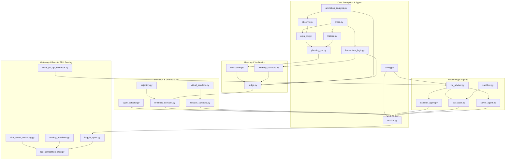

# ARC-AGI-3 LCLD Agent
# Engineering Specification — Version 10.8
# (Exhaustive Implementation Blueprint: Core Source Files, Brusentsov Entailment Operators, Carrollian Nullity Completeness, Empirical TransitionTable WorldModel [Trace + Quotient], Multi-Frame Animation & Transient Cells Engine, Triangulated Defeat Architecture, Peripheral HUD Filtering, Hungarian Jonker-Volgenant FrameDiff, ActionGuards, PriorityScheduler, ObservedEdgeOverlay, On-Mask Coordinate Probing, Two-Tier Action Lifecycle, Reactive DSL Invalidation, Universal Multimodal Dual-View, 5-Block Stratified Memory, State-Aware TabuFallback & Resilient Remote TPU/vLLM HTTP/2 Serving)

---

## 0. Engineering Objective & Implementation Contracts

This document provides the complete, authoritative implementation specification for the **ARC-AGI-3 LCLD Agent (Version 10.8)**. Any software engineer possessing standard Python 3.12 tools must be able to recreate, test, and deploy the entire codebase from scratch using only this document and the accompanying Architectural Specification, without ambiguity or external dependencies.

### 0.1 Key Engineering Contracts

1. **Standard 16-Color Palette ($0..15$) & Semantic Role Mapping**: ARC-AGI-3 operates over a 16-color palette (integers $0..15$). The agent maintains a persistent `PaletteRoleMap` tracking functional roles (`EntityRole`) for each color index, completely replacing destructive `[COLOR]` erasure with role-aware semantic labeling (`Color N (ROLE)`).
2. **Deterministic Perception, `grid_hash` & Identity Tracking**: ARGA-Lite object extraction, cavity detection, substantive spatial relation filtering ($area \ge 4$), deterministic MD5 `grid_hash` property on `ARGALiteSnapshot`, and multi-frame identity tracking via `PersistentObjectTracker`.
3. **Partitioned Action Space & Hardware Ban on `ACTION7`**:
   - Discrete directional/toggle actions: `ACTION1..5`.
   - Spatial coordinate clicks: `ACTION6(x, y)`.
   - Step-reversal (`ACTION7` / `Undo`) is **hardware-blocked** by architectural contract. Epistemic consistency is maintained strictly through forward deterministic planning and clean state resets ($S_0$).
4. **Dual-Space Coordinate Synchronization, On-Mask Pixel Selection & 1px Boundary Crop**: Raw environment frames are cropped by 1 border pixel on all 4 sides ($[1:-1, 1:-1]$), producing a local perception grid $(H-2) \times (W-2)$ with `crop_offset = 1`. Dispatched `ACTION6` actions shift local coordinates to engine coordinates (`local_x + crop_offset`, `local_y + crop_offset`). For hollow or concave objects (L-shapes, U-shapes, frames) where the bounding-box centroid falls on background cells, `_select_on_mask_pixel` selects the pixel in `obj.pixels` closest to the centroid. Deduplication in `tested_coords` symmetrically decodes engine coordinates back to local coordinates, preventing redundant probing cycles.
5. **Brusentsov 4-Valued Logic Engine & Carrollian Nullity Completeness**:
   - Mathematical realization of 4-valued judgments (`FOLLOW: +1`, `OMIT: 0`, `NULL: -1`, `UNDECIDED: SEEK`) in `v10_agent/brusentsov_logic.py`.
   - Strict 8-tier decision cascade in `v10_agent/judge.py`, default verdict `Verdict.OMIT`, empty expectation handling ($len(expected)=0 \to \text{IRRELEVANT}$), and ISO-10 candidate non-severance.
   - **Vacuous FOLLOW Prevention (Tier 8)**: Guard against the classical material implication paradox ($x'y \to \text{FOLLOW}$). Certified actions with non-zero delta but empty or unverified expected propositions evaluate strictly to `Verdict.OMIT`, never `FOLLOW`.
   - **Carrollian Nullity Completeness ($xy'_0 \to \text{NULL}$)** in `contradicts()`:
     - *Object Identity*: Expected `preserved`, observed `destroyed` / `vanished` / `missing`.
     - *Physical Stagnation*: Expected motion ($\Delta_{\text{exp}} \neq 0$), observed stationary ($\Delta_{\text{obs}} == 0$).
     - *Unintended Mutation*: Expected stationary/invariant ($\Delta_{\text{exp}} == 0$ or `unchanged`), observed motion ($\Delta_{\text{obs}} \neq 0$).
     - *Direction Inversion*: Expected vector sign opposite to observed vector sign ($\text{sign}(\Delta_{\text{exp}}) \times \text{sign}(\Delta_{\text{obs}}) < 0$).
     - Seamless normalization across tuple kinematics `(dy, dx)`, `moved`, `step_moved`, scalar signs `row_delta`, `col_delta`, and cross-comparisons.
   - **Kinematic Vacuity Guard on $S_0$**: In `evaluate_invariant_across_levels()`, kinematic rules evaluated on the pristine frame without actions taken evaluate strictly to `Ternary.IRRELEVANT`.
6. **Multi-Frame Animation & Transient Cells Engine (`v10_agent/animation_analysis.py`)**:
   - Ingests raw micro-step animation frames ($f_0 \dots f_k$) from `env.step`.
   - Detects transient cells changing $\ge 2$ times across the transition chain ($\Delta(r, c) \ge 2$).
   - Classifies trajectory geometry into `horizontal_beam`, `vertical_beam`, `vertical_sweep`, `horizontal_sweep`, `localized_pulse`, or `spatial_sweep`.
   - Constructs `transient_composite` 2D grid in active non-reverted colors.
   - In `v10_agent/judge.py` and `v10_agent/observe.py`, transient cell detection overrides zero-delta judgments, ensuring laser/projectile/scanner actions are classified as effective (`is_effective = True`) rather than passive self-loops.
7. **Triangulated Defeat Architecture ($F_{\text{alive}} \to F_{\text{fatal}} \to F_{\text{reset}}$)**:
   - Decouples the state before the fatal action ($F_{\text{alive}}$), the death collision frame ($F_{\text{fatal}}$), and the level initial state after reset ($F_{\text{reset}}$).
   - Augments `DefeatExemplar` with `fatal_step_diff` (isolating the exact lethal interaction), `fatal_transient_trajectory`, and `valid_prefix_actions`.
   - Formats Solver prompt with instructions to retain verified safe action prefixes and explore alternate branch actions strictly at or preceding the fatal frontier.
8. **Peripheral HUD & Dynamic Margin Filtering (`v10_agent/arga_lite.py`, `v10_agent/session.py`)**:
   - Detects peripheral components lying entirely within outer border strips (up to 2-3px) via `is_peripheral_hud_strip`.
   - Determines whether state deltas are exclusively peripheral HUD timer ticks via `is_only_peripheral_hud_delta`, preventing border clocks from disguising as effective gameplay mutations.
9. **5-Block Stratified Memory & Empirical `TransitionTable` WorldModel (Trace + Quotient)**:
   - 1) `PaletteRoleMap`: 16-color palette affordances, dynamic roles, pixel counts, and confidence.
   - 2) `CoreInvariantRegistry`: Symbolic rules (`GroundedInvariant`) grounded in physical exemplars (`NEGATIVE_BARRIER` from Defeat, `POSITIVE_CANON` from Victory).
   - 3) `EpisodicExemplarBuffer`: Concrete physical exemplars of terminal states (`DefeatExemplar` on `GAME_OVER`, `VictoryExemplar` on level victory).
   - 4) `CurriculumProgressionBuffer`: Cross-level trajectory history and distilled domain patterns.
   - 5) `WorkingRolloutMemory` & `TransitionTable`: Active candidate steps, propositions, and empirical state-transition graph (`TransitionRecord` trace + quotient graph indexed by `(pre_grid_hash, action_key)`) distinguishing `IDLE_SELF_LOOP` ($s \xrightarrow{a} s$ in specific state $s$) from `IDLE_UNLINKED` ($a$ never caused $\Delta > 0$ anywhere).
10. **Macro-Step Unrolling, Pre-Execution Idle Guard & Early Null Severance**:
    - Macro-commands like `action1(count=N)` are decomposed into $N$ atomic steps via `_decompose_expected_propositions_for_substep`. State invariants (`unchanged`, `preserved`) are assigned to all intermediate substeps, and single-step motion signs (`step_moved: (sgn(dy), sgn(dx))`) are checked at each transition.
    - **Pre-Execution Idle Self-Loop Guard (`ObservedEdgeOverlay`)**: Before dispatching a planned step to the arcade gateway, `SymbolicTrajectoryExecutor` queries `transition_table.is_known_idle_self_loop(current_grid_hash, action_id, coords)`. Known zero-delta self-loops in the current state are severed immediately (`Verdict.NULL`), saving environment steps.
    - Legacy `break_on_null` bypasses are completely eliminated. Any step receiving `Verdict.NULL` immediately terminates execution of the candidate (`sever()`), dropping remaining steps and synthesizing a structured diagnostic block (`_build_step_contradiction_diagnostic`).
    - The orchestrator dispatches a clean `RESET` to restore pristine state $S_0$, and records the physical grid diff into `failed_attempts_scratchpad`.
11. **Two-Tier Action Lifecycle & Affordance Completeness**:
    - Primitive probe management (`PrimitiveProbeManager`) distinguishes actions with immediate observable delta from conditional triggers. Actions with $\Delta = 0$ on pristine frame $S_0$ are tracked in `conditional_candidate_actions` and preserved in `available_actions` with affordance `EffectClass.CONDITIONAL_TRIGGER` (`status: unconfirmed_on_s0`) rather than being discarded.
    - Once an action demonstrates an observable delta in any subsequent state, it transitions immediately into `confirmed_effective_actions`.
12. **Reactive DSL Invalidation & Auto-Augmentation**:
    - When any confirmed action missing from the current active manifest is observed during probing, solver execution, or direct fallback, `GameSession` triggers reactive invalidation: `active_module = None`, `active_manifest = None`, `coder_failed_for_level = False`, and `replan_requested = True`.
    - `DSLCoder.generate_dsl` automatically synthesizes canonical sandboxed wrappers (`def actionX(api): ...`) and manifest descriptors for any confirmed actions omitted by the LLM Coder output.
13. **Universal Multimodal Dual-View**:
    - Generates synchronized pairs of PNG frames: `raw_frame.png` (unannotated pristine pixels) and `annotated_frame.png` (bounding boxes, object aliases, centroids).
    - Passed to Explorer, Coder, and Solver agents to eliminate perceptual blindness to multi-color compound objects caused by monochromatic connected-component parsing.
    - Strict Cartesian $(Row, Col) \leftrightarrow (Y, X)$ coordinate disambiguation ($X=\text{column}, Y=\text{row}$).
14. **Clean Physics Simulator & Generalized Aspect Ratio**: Aspect ratio heuristics ($\ge 3.0$) replace puzzle-specific constants. Domain-general topological invariants (`ConnectedComponentConservation`, `GravitySettling`, `ContactTrigger`, `AreaConservation`) model world physics without geometric hardcoding.
15. **Generalized A* Search with `ObservedEdgeOverlay`, `ACTION6` Coordinate Synthesis & State-Aware `TabuFallback`**:
    - `VirtualKinematicSandbox` (`v10_agent/virtual_sandbox.py`) integrates empirical `TransitionTable` edges into A* expansion (skipping known `IDLE_SELF_LOOP` / `LOSS` edges) and repairs invalid LLM trajectories via `validate_and_repair_candidates()`. For `ACTION6`-only games, it synthesizes multi-step invariant coordinate trajectories over confirmed effective coordinates and substantive object masks.
    - `SymbolicFallbackEngine` (`v10_agent/fallback_symbolic.py`) selects the actor empirically from `TransitionTable.moved_object_ids` and `GameMemory.confirmed_actor_ids` (filtering full-board frames $\ge 50\%$ grid area) and applies state-aware `tabu_counts[(state_hash, action_key)]` and `dead_end_edges` pruning.
16. **Multi-Trajectory Candidate Pool Traversal via Clean RESET**: Solver plans complete multi-step trajectory packages upfront (up to 4 candidate paths per package); execution is handled deterministically step-by-step by `SymbolicTrajectoryExecutor` with clean environmental resets (`RESET` $\to S_0$) between candidates under a hard limit of 5 attempts per level.
17. **Pristine Frame Invariant Discovery**: Cross-level invariant re-evaluation is deferred to the pristine initial frame of the new level ($S_0$, `level_initial_grid is None`).
18. **Coordinate-Aware VisibleCycle Loop Recovery**: Fast row-level MD5 hashing detecting repeating state-action orbits (periods 1..8, $\ge 2$ repetitions, $\ge 8$ actions) where `ACTION6` steps include coordinates in the action key (`ACTION6:x,y`), preventing false-positive cycle triggers on distinct object clicks (`v10_agent/cycle_detector.py`, `v10_agent/session.py`).
19. **Time Budgeting & Deadline Safety**: Dynamic time tracking with a 15-second reserve; automatic LLM request abort upon reserve breach; socket timeout clamping; and graceful competition child exit (`v10_agent/config.py`, `v10_agent/llm_advisor.py`, `lcld_competition_child.py`).
20. **Production Remote TPU v5e-8 & Local vLLM Serving Architecture**:
    - Dedicated TPU generator (`notebooks/tpu_api_server/build_tpu_api_notebook.py`) downloading fresh official `cloudflared` binary via `curl -fsSL` from GitHub.
    - Enforces `--protocol http2` flag on Cloudflare quick tunnel to bypass Kaggle outbound UDP/QUIC drops, ensuring resilient 9-hour HTTP/2 tunnels.
    - Dedicated 60-second auto-reconnection watchdog script and real-time streaming logs in `/tmp/cloudflared.log`.
    - Local fallback runtime with non-blocking watchdog (`vllm_server_watchdog.py`) and sub-millisecond socket teardown (`serving_teardown.py`).
21. **AST Code Guardian & Quality Assurance Stack**:
    - `tools/ast_code_guardian.py`: Static AST visitor verifying abstract purity, prohibition of benchmark puzzle IDs, prohibition of heuristic tokens (`piece_steps`, `axis_steps`), and absence of geometric hardcoding across 137 files.
    - Property-Based Testing with Hypothesis: `test_pbt_brusentsov_axioms.py`, `test_pbt_brusentsov_severance.py`, `test_pbt_scale_invariance.py`, `test_pbt_color_permutation.py`, `test_pbt_coordinate_isomorphism.py`.
    - Unit & Integration Test Suite: comprehensive suite (522 tests) with 100% passing coverage of Brusentsov axioms, scale invariance, animation analysis, and orchestration contracts.
22. **Jonker-Volgenant Optimal Bipartite Hungarian Matching & Entity Frame Differencing (`v10_agent/frame_diff.py`)**: Inter-frame displacement tracking classifies connected components using the Jonker-Volgenant linear sum assignment algorithm. Emits semantic deltas: Translation (`moved`, `step_moved`), Rotation (`rotated`), Scaling (`resized`), Color Change (`color_changed`), Spawning/Destruction (`appeared`, `disappeared`). Isolates peripheral HUD progress bars and timers by bounding box and border analysis, shielding gameplay deltas from spurious ticks.
23. **Action Guards & Resilient Interior Grid Hashing (`v10_agent/action_guards.py`)**: `NoopRepeatGuard` monitors consecutive actions and blocks repetitions that yield zero gameplay delta. `DeathActionGuard` records fatal state-action transitions `(interior_hash, action_sig)`. Invariant interior grid hashing strips outer margins to ensure state signatures remain stable despite peripheral HUD variations.
24. **Dynamic Priority Compute Allocation (`priority_scheduler.py`)**: Dynamic scheduling formula $P = (A + B) \cdot C$, where $A$ is level completion ratio, $B$ is attempt progress bonus, and $C$ is stall decay factor. Dynamically reallocates concurrency and execution priority to tasks showing measurable progress, throttling dead-end levels.
25. **Strict Single-Run Fallback Execution Contract Without Reset**: The agent is bounded by a strict structural lifecycle: up to 5 attempts with LLM solver $\to$ exactly ONE continuous symbolic fallback run $\to$ clean abandonment without reset on `GAME_OVER`, cycle, or action budget exhaustion. In fallback mode, `RESET` is strictly prohibited under all circumstances.
26. **Per-Level Action Budget Hard Ceiling (`max_actions_per_level = 80`)**: Protects the 9-hour competition window by enforcing an 80-action ceiling per level in `lcld_competition_child.py`, preventing runaway loops from monopolizing resources.

---

## 1. File Hierarchy & Dependency Graph

The production deployment consists of the following core files and testing suites (137 Python files audited):

```
c:/arcprize/
├── kaggle_agent.py                             # Competition gateway adapter (ARC_AGI_Agent)
├── submission.py                               # Configuration defaults and canonical enum mappers
├── lcld_competition_child.py                   # Isolated child process runner & game execution loop
├── lcld_preflight.py                           # Structural preflight verification suite
├── phase_a_heavy_smoke.py                      # Offline wheelhouse installer & dynamic vLLM server
├── serving_setup.py                            # Flash-Next compatible serving lifecycle manager
├── serving_teardown.py                         # Sub-millisecond socket probe & process teardown
├── vllm_server_watchdog.py                     # Non-blocking RLock health watchdog daemon
├── build_notebook_v10.py                       # Self-extracting LZMA base64 notebook builder
│
├── notebooks/
│   └── tpu_api_server/
│       └── build_tpu_api_notebook.py           # Remote TPU v5e-8 notebook generator (HTTP/2, fresh cloudflared, 60s watchdog)
│
├── tools/
│   └── ast_code_guardian.py                    # Static AST code purity & anti-gaming auditor (137 files)
│
└── v10_agent/
    ├── __init__.py                             # Package exports and version metadata (10.8.0)
    ├── action_adapter.py                       # Native ActionInput and arcade dict converters
    ├── action_guards.py                        # NoopRepeatGuard, DeathActionGuard & compute_interior_grid_hash
    ├── action_semantics.py                     # Single source of truth: ACTION vectors, legal/forbidden ids, displacement tokenizers
    ├── animation_analysis.py                   # Multi-frame animation analysis & transient cells detection (Delta >= 2)
    ├── arga_lite.py                            # Deterministic ARGA-Lite perception, grid_hash, HUD strip detection
    ├── brusentsov_logic.py                     # Brusentsov 4-valued Verdict, logic operators & judgments
    ├── config.py                               # V10Config dataclass, deadline tracker & CLI builder
    ├── cycle_detector.py                       # Coordinate-aware VisibleCycle orbit detector & MD5 grid hasher
    ├── dsl_coder.py                            # Coder Agent (Call 2), AST validator & auto code augmentation
    ├── explorer_agent.py                       # Explorer Agent (Call 1), on-mask coordinate probing & animation telemetry
    ├── fallback_symbolic.py                    # State-aware TabuFallback engine wrapping A* search & empirical actor selection
    ├── frame_diff.py                           # Jonker-Volgenant bipartite entity matching & HUD progress bar isolation
    ├── frame_media.py                          # Dual-view visualization: raw & annotated PNG renderers
    ├── game_adapter.py                         # Game session interface adapters
    ├── judge.py                                # LayeredVerifier with strict 8-tier decision cascade & transient cell overrides
    ├── llm_advisor.py                          # LLM client (vLLM / TPU OpenAI API, streaming, timeout clamp)
    ├── logging.py                              # Structured JSON audit and session logger
    ├── memory_contours.py                      # 5 memory blocks + Empirical TransitionTable (with Triangulated Defeat)
    ├── observe.py                              # Observation normalization, 1px cropping & intermediate frame analysis
    ├── planning_set.py                         # Immutable PlanningSet with crop_offset, PlanningObject & Relations
    ├── policy.py                               # Action arbitration policy
    ├── priority_scheduler.py                   # Dynamic compute priority scheduler (P = (A + B) * C)
    ├── sandbox.py                              # Restricted AST validator & SandboxExecutor
    ├── session.py                              # Master GameSession orchestrator, Triangulated Defeat & reactive invalidation
    ├── solver_agent.py                         # Solver Agent (Call 3), XML trajectory parser, safe prefix prompt grounding
    ├── symbolic_executor.py                    # SymbolicTrajectoryExecutor with pre-execution idle guard & early severance
    ├── tracker.py                              # PersistentObjectTracker & TrackedObject permanence
    ├── trajectory.py                           # CandidateTrajectory, TrajectoryPool (peek_active_candidate / advance_to_next_candidate)
    ├── types.py                                # Core types: Grid2D, BoundingBox, Centroid, Propositions
    ├── universal_invariants.py                 # Topological invariants & domain-general discovery
    ├── verification.py                         # VerificationBinder & PropositionSet grounding
    ├── verifier_packet.py                      # Structured symbolic verifier exchange packet
    ├── virtual_sandbox.py                      # Generalized A* search with ObservedEdgeOverlay & ACTION6 coordinate synthesis
    │
    ├── prompt_builders/
    │   ├── __init__.py                         # Prompt builder exports
    │   ├── coder_prompt.py                     # Incremental DSL implementation prompt templates
    │   ├── explorer_prompt.py                  # Probing and coordinate hypothesis templates
    │   └── solver_prompt.py                    # Declarative multi-candidate planning templates (with Triangulated Defeat)
    │
    └── tests/
        ├── test_pbt_brusentsov_axioms.py       # Hypothesis PBT: Brusentsov logic mathematical axioms
        ├── test_pbt_brusentsov_severance.py    # Hypothesis PBT: Carrollian nullity completeness & early severance
        ├── test_pbt_scale_invariance.py        # Hypothesis PBT: Grid scale invariance (2x2 .. 64x64)
        ├── test_pbt_color_permutation.py       # Hypothesis PBT: 16-color palette invariance
        ├── test_pbt_coordinate_isomorphism.py  # Hypothesis PBT: Dual-space coordinate translation
        ├── test_reactive_dsl_invalidation.py   # Unit test: Two-tier actions, reactive DSL invalidation & augmentation
        ├── test_universal_multimodal_dual_view.py # Unit test: DualView frame rendering & multimodal routing
        ├── test_transient_cells_and_animation.py  # Multi-frame animation & transient cells unit & integration suite
        ├── test_fatal_frame_and_reset_decoupling.py # Triangulated Defeat, fatal diff & safe prefix retention
        ├── test_synthetic_calibration_worlds.py # Synthetic micro-worlds: maze, gravity, contact button
        ├── test_memory_exemplars.py            # DefeatExemplar, VictoryExemplar & GroundedInvariant tests
        └── ...                                 # Comprehensive unit and integration test suite (522 tests)
```

### 1.1 Dependency Graph



---

## 2. Configuration Contract (`v10_agent/config.py`)

All runtime options, budgets, server flags, and deadline thresholds are consolidated in `V10Config`:

```python
@dataclass
class V10Config:
    # LLM Backend & Model Configuration
    llm_advisor_backend: str = "vllm"                      # "vllm" | "fake" | "ollama" | "llama_cli"
    model_path: str = "Qwen/Qwen3.8-27B"
    qwen_model_path: str = "Qwen/Qwen3.8-27B"
    vllm_base_url: str = "http://127.0.0.1:1234/v1"
    qwen_vllm_base_url: str = "http://127.0.0.1:1234/v1"
    vllm_api_key: str = "EMPTY"
    qwen_vllm_api_key: str = "EMPTY"
    context_tokens: int = 262144
    qwen_context_tokens: int = 262144
    max_input_tokens: int = 131072
    qwen_max_input_tokens: int = 131072
    max_output_tokens: int = 131072
    qwen_max_output_tokens: int = 131072
    temperature: float = 1.0
    qwen_temperature: float = 1.0
    solver_temperature: float = 1.0
    coder_temperature: float = 1.0
    explorer_temperature: float = 1.0
    top_p: float = 0.95
    qwen_top_p: float = 0.95
    top_k: int = 20
    qwen_top_k: int = 20
    min_p: float = 0.0
    qwen_min_p: float = 0.0
    presence_penalty: float = 0.0
    qwen_presence_penalty: float = 0.0
    repeat_penalty: float = 1.0
    qwen_repeat_penalty: float = 1.0
    seed: int = 42
    qwen_seed: int = 42
    timeout_seconds: int = 700
    qwen_timeout_seconds: int = 700
    multimodal_enabled: bool = True
    qwen_multimodal_enabled: bool = True
    solver_multimodal_enabled: bool = True
    explorer_multimodal_enabled: bool = True
    coder_multimodal_enabled: bool = True
    enable_thinking: bool = True
    qwen_enable_thinking: bool = True
    reasoning_strength: str = "xhigh"                       # "low" | "medium" | "high" | "xhigh"
    reasoning_budget_tokens: int = 131072
    qwen_reasoning_budget_tokens: int = 131072
    solver_reasoning_budget_tokens: int = 131072
    coder_reasoning_budget_tokens: int = 65536
    explorer_reasoning_budget_tokens: int = 65536
    solver_max_output_tokens: int = 131072
    coder_max_output_tokens: int = 65536
    explorer_max_output_tokens: int = 65536

    # Trajectory & Solver Package Limits
    max_candidates_per_solver_package: int = 4
    max_steps_per_candidate: int = 30
    execute_one_step_at_a_time: bool = True

    # Multi-Token Prediction (MTP=5) Speculative Decoding
    vllm_mtp_enabled: bool = True
    vllm_mtp_tokens: int = 5
    vllm_speculative_method: str = "mtp"
    vllm_speculative_model: str | None = None
    vllm_speculative_config: str | None = None
    vllm_speculative_cli_format: str = "auto"

    # vLLM Server Launch Parameters (Official Qwen3.8-27B Recipes)
    vllm_enable_prefix_caching: bool = True
    vllm_enable_chunked_prefill: bool = True
    vllm_async_scheduling: bool = True
    vllm_no_enable_log_requests: bool = True
    vllm_disable_uvicorn_access_log: bool = True
    vllm_enable_auto_tool_choice: bool = True
    vllm_tool_call_parser: str = "qwen3_xml"
    vllm_mm_encoder_tp_mode: str = "data"
    vllm_reasoning_parser: str = "qwen3"
    vllm_max_model_len: int = 262144

    # Persistent Object Tracker & 4-Valued Verdict Knobs
    enable_persistent_tracker: bool = True
    track_match_threshold: float = 0.45
    track_max_age: int = 5
    matching_ambiguity_threshold: float = 0.15
    min_reliable_delta: float = 0.8
    track_confidence_threshold: float = 0.6
    occlusion_radius: int = 3
    cumulative_window: int = 3
    track_min_area: int = 1
    enable_undecided_verdict: bool = True
    max_undecided_streak: int = 2
    max_evidence_probes_per_level: int = 3
    min_remaining_actions_for_probe: int = 25

    # Deterministic Sandbox
    sandbox_enabled: bool = True
    sandbox_allowed_modules: list[str] = ["math", "typing", "dataclasses", "enum", "collections"]
    sandbox_max_cpu_seconds: float = 10.0
    sandbox_max_memory_mb: int = 512

    # Deadline Reserve & Time Budgeting
    deadline_reserve_seconds: float = 15.0
    _deadline_time: float | None = None

    # VisibleCycle Loop Recovery
    enable_cycle_detector: bool = True
    cycle_detector_min_actions: int = 8
    cycle_detector_max_period: int = 8
    cycle_detector_min_cycles: int = 2
    cycle_detector_per_level_limit: int = 2

    # Memory Contours & Isolation
    game_memory_reset_on_game_change: bool = True
    game_memory_reset_on_level_change: bool = False
    epistemic_memory_max_entries: int = 50
    syntax_error_memory_max_entries: int = 5
    crop_border_pixels: int = 1

    # Fallback System & Probing Budgets
    enable_symbolic_fallback: bool = True
    coder_exhaustion_forces_fallback: bool = True
    solver_exhaustion_forces_fallback: bool = True
    abort_on_dsl_exhaustion: bool = False
    max_primitive_probes_per_level: int = 16
    enable_primitive_probing: bool = True
    probe_reset_after_discrete: bool = False

    # Competition Ceilings
    max_actions_per_game: int = 500
    max_actions_per_level: int = 80
    max_game_over_resets_per_level: int = 5
    max_chain_attempts_per_level: int = 5
    max_coder_retries_per_level: int = 5
    max_solver_retries_per_level: int = 5
    max_explorer_attempts_per_level: int = 2
    max_explorer_probe_steps: int = 2
    max_invariant_verification_probes: int = 3
    max_invariant_probe_steps: int = 2
    max_explorer_probe_actions_per_level: int = 30
    reset_on_game_over: bool = True
    game_wall_clock_limit_seconds: float = 5000.0
    competition_wall_clock_limit_seconds: float = 30600.0
    concurrency: int = 8
    vllm_max_num_seqs: int = 8
    vllm_startup_timeout_seconds: int = 900
```

---

## 3. Mathematical Logic Engine (`v10_agent/brusentsov_logic.py`)

### 3.1 Mathematical Realization of Brusentsov Entailment

```python
from enum import Enum
from typing import Any

class Ternary(Enum):
    """Pure Brusentsov ternary truth values for transition verdicts."""
    TRUE = 1          # FOLLOW: Trajectory step confirmed; necessary containment held (xy)
    FALSE = -1        # NULL: Hard physical contradiction; branch severed (xy'0)
    IRRELEVANT = 0    # OMIT: Inessential / passive outcome; branch preserved (x'y or x'y')

    def __eq__(self, other: Any) -> bool:
        if isinstance(other, Verdict):
            return other == self
        return super().__eq__(other)

    def __hash__(self) -> int:
        return super().__hash__()


class EpistemicSignal(Enum):
    """Controller signals. Not truth values."""
    SEEK_EVIDENCE = 1


class Verdict(Enum):
    """Full judge verdict = logical value or epistemic signal."""
    FOLLOW = "FOLLOW"        # maps to Ternary.TRUE
    NULL = "NULL"            # maps to Ternary.FALSE
    OMIT = "OMIT"            # maps to Ternary.IRRELEVANT
    UNDECIDED = "UNDECIDED"  # maps to EpistemicSignal.SEEK_EVIDENCE

    @property
    def ternary(self) -> Ternary | None:
        if self is Verdict.FOLLOW: return Ternary.TRUE
        if self is Verdict.NULL: return Ternary.FALSE
        if self is Verdict.OMIT: return Ternary.IRRELEVANT
        return None

    @classmethod
    def from_ternary(cls, t: Ternary) -> "Verdict":
        if t is Ternary.TRUE: return cls.FOLLOW
        if t is Ternary.FALSE: return cls.NULL
        if t is Ternary.IRRELEVANT: return cls.OMIT
        raise ValueError(f"Cannot map {t} to Verdict")

    def __eq__(self, other: Any) -> bool:
        if isinstance(other, Ternary):
            if self is Verdict.FOLLOW: return other is Ternary.TRUE
            if self is Verdict.NULL: return other is Ternary.FALSE
            if self is Verdict.OMIT: return other is Ternary.IRRELEVANT
            return False
        return super().__eq__(other)

    def __hash__(self) -> int:
        return super().__hash__()
```

### 3.2 Auditable Judgment Structure (`BrusentsovJudgment`)

```python
@dataclass(frozen=True)
class BrusentsovJudgment:
    """Auditable transition evaluation judgment grounded on Brusentsov logic."""
    trajectory_id: str
    step_id: str
    verdict: Verdict | Ternary
    expected_propositions: PropositionSet
    observed_propositions: PropositionSet
    explanation: str = ""
    timestamp: float = field(default_factory=time.time)
    ambiguity_score: float | None = None
    evidence_hint: str | None = None
    matching_candidates: list[str] = field(default_factory=list)
    track_confidence_min: float | None = None
    action_dict: dict[str, Any] = field(default_factory=dict)
    is_effective: bool = False

    @property
    def ternary_verdict(self) -> Verdict | Ternary:
        return self.verdict
```

### 3.3 Propositional Entailment (`implies_brusentsov`) & Carroll Nullity

```python
def implies_brusentsov(expected: PropositionSet, observed: PropositionSet) -> Ternary:
    """Evaluate necessary implication following Brusentsov ternary logic."""
    if len(expected) == 0:
        return Ternary.IRRELEVANT

    for e in expected:
        for o in observed:
            if contradicts(e, o):
                return Ternary.FALSE

        if e.family == "object_identity" and e.predicate == "preserved":
            is_destroyed = any(
                o.family == "object_identity"
                and (o.subject_id == e.subject_id or not e.subject_id)
                and o.predicate in {"destroyed", "missing", "vanished"}
                for o in observed
            )
            if is_destroyed:
                return Ternary.FALSE

    if all(is_necessarily_contained(e, observed) for e in expected):
        return Ternary.TRUE

    return Ternary.IRRELEVANT
```

---

## 4. Perception, Animation Analysis & Dual-Space Coordinate Grounding

### 4.1 Multi-Frame Animation & Transient Cells Engine (`v10_agent/animation_analysis.py`)

Extracts and models ephemeral micro-frame animation sequences from `arcengine`:

```python
def extract_raw_frame_sequence(raw_frame_data: Any) -> list[Grid2D]:
    """Extract ordered list of 2D grids from raw FrameData.frame or sequence."""
    ...

def collapse_animation_chain(before_grid: Grid2D | None, frames: Sequence[Grid2D]) -> list[Grid2D]:
    """Prepend pre-action grid and collapse consecutive duplicate frames."""
    ...

def extract_transient_cells(
    chain: Sequence[Grid2D],
    ignore_peripheral_hud: bool = True,
) -> list[tuple[int, int]]:
    """Return coordinates of cells that change two or more times across the chain (Delta >= 2)."""
    ...

def analyze_animation_trajectory(
    chain: Sequence[Grid2D],
    transient_cells: list[tuple[int, int]] | None = None,
    max_timeline_steps: int = 15,
    max_cells_per_step: int = 24,
) -> dict[str, Any] | None:
    """Analyze transient cells and return structured trajectory and animation metadata.
    Classifies geometry: horizontal_beam, vertical_beam, vertical_sweep,
    horizontal_sweep, localized_pulse, or spatial_sweep.
    """
    ...

def build_transient_composite_grid(
    chain: Sequence[Grid2D],
    transient_cells: Sequence[tuple[int, int]],
    background_color: int = 0,
) -> Grid2D:
    """Build a composite grid with transient paths rendered in their active non-reverted colors."""
    ...
```

### 4.2 Peripheral HUD & Margin Filtering (`v10_agent/arga_lite.py`)

```python
def is_peripheral_hud_strip(obj: Any, grid_shape: tuple[int, int], max_margin: int = 3) -> bool:
    """Check if component is located strictly within peripheral border margins (e.g., timer/score)."""
    h, w = grid_shape
    if h <= 2 * max_margin or w <= 2 * max_margin:
        return False
    min_r, min_c, max_r, max_c = obj.bounding_box
    return (max_r < max_margin or min_r >= h - max_margin or max_c < max_margin or min_c >= w - max_margin)

def is_only_peripheral_hud_delta(before_grid: Grid2D, after_grid: Grid2D, border_thickness: int = 3) -> bool:
    """Check if differences between two grids are strictly confined to peripheral outer margins."""
    ...
```

### 4.3 On-Mask Coordinate Probing (`v10_agent/explorer_agent.py`)

```python
def _select_on_mask_pixel(obj: Any) -> tuple[int, int]:
    """Select actual on-mask pixel closest to centroid to avoid hollow cavities."""
    cy, cx = float(obj.centroid.row), float(obj.centroid.col)
    rc, cc = int(round(cy)), int(round(cx))
    pixels = getattr(obj, "pixels", None)
    if not pixels:
        return (cc, rc)  # (local_x, local_y)
    if (rc, cc) in pixels:
        return (cc, rc)
    best_r, best_c = min(pixels, key=lambda p: (p[0] - cy) ** 2 + (p[1] - cx) ** 2)
    return (int(best_c), int(best_r))
```

---

## 5. Stratified 5-Block Memory, Defeat Triangulation & Empirical TransitionTable

### 5.1 Triangulated `DefeatExemplar` (`v10_agent/memory_contours.py`)

```python
@dataclass
class DefeatExemplar:
    """Concrete example of a fatal error — grounding for NEGATIVE_BARRIER invariants (xy'_0 -> NULL)."""
    level_index: int
    fatal_step: int
    fatal_action_id: int                         # 1..6
    fatal_coords: tuple[int, int] | None = None  # (x, y) for ACTION6
    actor_position_before: tuple[int, int] = (0, 0)
    hazard_color: int = -1                       # Color 0..15
    pre_defeat_subgrid: list[list[int]] = field(default_factory=list)
    fatal_grid: list[list[int]] = field(default_factory=list)
    environment_signal: str = ""
    explanation: str = ""
    timestamp: float = field(default_factory=time.time)
    fatal_step_diff: dict[str, Any] = field(default_factory=dict)
    fatal_transient_trajectory: str = ""
    valid_prefix_actions: list[str] = field(default_factory=list)

    def format_for_prompt(self) -> str:
        coord_str = f" at coords ({self.fatal_coords[0]}, {self.fatal_coords[1]})" if self.fatal_coords else ""
        lines = [
            f"LAST DEFEAT (Level {self.level_index}, Step {self.fatal_step}):",
            f"  Fatal Action: ACTION{self.fatal_action_id}{coord_str}",
            f"  Actor was at: row={self.actor_position_before[0]}, col={self.actor_position_before[1]}",
        ]
        if self.hazard_color >= 0:
            lines.append(f"  Hazard color: {self.hazard_color}")
        lines.append(f"  Signal: {self.environment_signal}")

        if self.fatal_step_diff:
            changed_cells = self.fatal_step_diff.get("changed_cell_count", 0)
            diff_parts = []
            if self.fatal_step_diff.get("moved"):
                for m in self.fatal_step_diff["moved"][:2]:
                    dr, dc = m.get("dr", 0), m.get("dc", 0)
                    diff_parts.append(f"moved dy={dr}, dx={dc}")
            if self.fatal_step_diff.get("disappeared"):
                diff_parts.append(f"{len(self.fatal_step_diff['disappeared'])} entity destroyed/vanished")
            diff_desc = ", ".join(diff_parts) if diff_parts else f"{changed_cells} cells changed"
            lines.append(f"  Fatal Step Outcome: {diff_desc}")

        if self.fatal_transient_trajectory:
            lines.append(f"  Fatal Animation: {self.fatal_transient_trajectory}")

        if self.valid_prefix_actions:
            prefix_str = " -> ".join(str(a) for a in self.valid_prefix_actions[:15])
            if len(self.valid_prefix_actions) > 15:
                prefix_str += "..."
            lines.append(
                f"  RETAIN PREFIX: Steps 1..{len(self.valid_prefix_actions)} were SAFE: [{prefix_str}]. "
                f"KEEP this prefix and branch to an alternate safe action at step {self.fatal_step}!"
            )

        lines.append(f"  Lesson: {self.explanation}")
        lines.append(
            "  DETERMINISM ENFORCEMENT: Environment is deterministic. Replaying the exact same actions to this point will cause death again. Plan an alternate path before the fatal step!"
        )
        return "\n".join(lines)
```

### 5.2 Empirical `TransitionTable` WorldModel (Trace + Quotient)

```python
@dataclass
class TransitionRecord:
    """Single empirical transition edge recorded from real environment execution."""
    pre_grid_hash: str
    action_id: str
    coords: tuple[int, int] | None = None
    post_grid_hash: str = ""
    delta_cells: int = 0
    centroid_shifts: dict[str, tuple[float, float]] = field(default_factory=dict)
    moved_object_ids: list[str] = field(default_factory=list)
    outcome_class: str = "EFFECTIVE"  # "EFFECTIVE" | "IDLE_SELF_LOOP" | "LOSS" | "WIN"
    step_index: int = 0
    observed_effect: str = ""
```

---

## 6. Universal Invariants, `VirtualKinematicSandbox` & State-Aware `TabuFallback`

### 6.1 State-Aware `SymbolicFallbackEngine` (`v10_agent/fallback_symbolic.py`)

- Grounded actor selection checks (1) non-zero displacements in `TransitionTable.transitions`, (2) `confirmed_actor_ids`, (3) `PaletteRoleMap.EntityRole.ACTOR`.
- Synchronizes with `TransitionTable` to maintain state-action `tabu_counts`, `dead_end_edges`, and `visited_state_counts`.
- Strictly excludes `RESET` from allowed action choices.

### 6.2 Action Guards (`v10_agent/action_guards.py`)

- `NoopRepeatGuard`: Caches last executed action and blocks immediate re-execution if it produced zero interior delta.
- `DeathActionGuard`: Records lethal `(interior_hash, action_signature)` pairs upon `GAME_OVER`.
- `compute_interior_grid_hash`: Strips outer 1px borders to ensure state signatures remain stable despite peripheral HUD timer ticks.

---

## 7. Verification & Judge Cascade (`v10_agent/judge.py`)

### 7.1 Strict 8-Tier Decision Cascade with Transient Overrides

```python
# Tier 1: Terminal Win Condition (WIN / levels_completed increase)
if terminal_win:
    return BrusentsovJudgment(verdict=Verdict.FOLLOW, ...)

# Tier 2: Terminal Loss Condition (GAME_OVER / LOST)
if terminal_loss:
    return BrusentsovJudgment(verdict=Verdict.NULL, ...)

# Tier 3: Zero Grid Delta on Confirmed Motion Action (with transient override)
if zero_delta and is_confirmed_motion and not has_transient_cells:
    if is_boundary_collision:
        return BrusentsovJudgment(verdict=Verdict.OMIT, ...) # Soft stop
    return BrusentsovJudgment(verdict=Verdict.NULL, ...)     # Contradiction

# Tier 4: Epistemic Uncertainty & Multi-Frame Ambiguity
if ambiguity_detected:
    return BrusentsovJudgment(verdict=Verdict.UNDECIDED, ...)

# Tier 5: Explicit EXPECT Contradiction
if prop_verdict == Ternary.FALSE:
    return BrusentsovJudgment(verdict=Verdict.NULL, ...)

# Tier 6: Explicit EXPECT Containment
if prop_verdict == Ternary.TRUE:
    return BrusentsovJudgment(verdict=Verdict.FOLLOW, ...)

# Tier 7: Unconfirmed Zero Delta or Low Metric Delta
if zero_delta and not has_transient_cells:
    return BrusentsovJudgment(verdict=Verdict.UNDECIDED, ...)

# Tier 8: Action Effect Verification & Vacuous Follow Elimination
if act_id and confirmed_eff:
    if not zero_delta or has_transient_cells:
        if len(step.expected_propositions) > 0 and prop_verdict == Ternary.TRUE:
            return BrusentsovJudgment(verdict=Verdict.FOLLOW, is_effective=True, ...)
        else:
            return BrusentsovJudgment(verdict=Verdict.OMIT, is_effective=is_effective, ...)

return BrusentsovJudgment(verdict=Verdict.OMIT, ...)
```

---

## 8. Execution Engine & Session Orchestration (`v10_agent/session.py`)

### 8.1 Triangulated Defeat Grounding on `GAME_OVER`

```python
if env_state == "GAME_OVER":
    fatal_frame = raw_obs.get("frame")
    alive_frame = self.last_alive_frame
    
    # Compute isolated fatal step delta (F_alive -> F_fatal)
    fatal_diff = self._compute_isolated_fatal_diff(alive_frame, fatal_frame)
    
    # Capture active transient projectile/beam trajectory
    anim_traj = self._extract_fatal_animation_trajectory(raw_obs)
    
    # Construct DefeatExemplar preserving valid safe prefix
    exemplar = DefeatExemplar(
        level_index=self.current_level,
        fatal_step=self.current_attempt_step_count,
        fatal_action_id=self.last_action_id,
        fatal_coords=self.last_coords,
        actor_position_before=self.last_actor_pos,
        hazard_color=self.last_hazard_color,
        fatal_step_diff=fatal_diff,
        fatal_transient_trajectory=anim_traj,
        valid_prefix_actions=list(self.active_safe_prefix_actions),
        environment_signal="GAME_OVER",
    )
    self.game_memory.last_defeat_exemplar = exemplar
    
    # Sever active candidate and issue clean reset to S0
    self.active_pool.peek_active_candidate().sever()
    return self._emit_reset(reason="game_over_triangulated_reset")
```

---

## 9. Production Serving & Reliability Infrastructure

### 9.1 Remote TPU v5e-8 Serving Notebook (`notebooks/tpu_api_server/build_tpu_api_notebook.py`)

- Generates standalone Kaggle notebook for Qwen3.8-27B serving on TPU v5e-8.
- Key features:
  1. Downloads official fresh `cloudflared` binary directly via `curl -fsSL` from GitHub on every launch.
  2. Enforces `--protocol http2` flag on quick tunnel to bypass Kaggle outbound UDP drops.
  3. Real-time stdout streaming of tunnel connection URL.
  4. 60-second auto-reconnection watchdog script monitoring and auto-restarting Cloudflare tunnels upon disconnect.
  5. Precompiled XLA cache restoration from tarball archives and loose JIT files for sub-3-minute warm starts.

### 9.2 Official Production vLLM CUDA Serving (Qwen3.8-27B)

Per official [vLLM Recipes](https://recipes.vllm.ai/Qwen/Qwen3.8-27B) and [vLLM MultimodalConfig](https://docs.vllm.ai/en/stable/configuration/engine_args/#multimodalconfig):
```bash
vllm serve Qwen/Qwen3.8-27B \
  --max-num-seqs 8 \
  --tensor-parallel-size 1 \
  --max-model-len 262144 \
  --enable-auto-tool-choice \
  --tool-call-parser qwen3_xml \
  --mm-encoder-tp-mode data \
  --reasoning-parser qwen3 \
  --speculative-config '{"method":"mtp","num_speculative_tokens":5}'
```

Architectural guarantees:
1. **Native 262K Context**: `--max-model-len 262144` leverages Qwen3.8-27B native context window.
2. **Multi-Token Prediction (MTP=5)**: `--speculative-config '{"method":"mtp","num_speculative_tokens":5}'` matches pre-trained draft head depth.
3. **Native Engine Reasoning Parser**: `--reasoning-parser qwen3` separates `<think>` into `delta.reasoning_content` natively.
4. **Native Tool Calling**: `--enable-auto-tool-choice --tool-call-parser qwen3_xml` parses Qwen XML into standard OpenAI `tool_calls`.
5. **Data-Parallel Vision**: `--mm-encoder-tp-mode data` accelerates multi-image prefill.
6. **Native Multimodal Support**: Default limit is 999 per modality in vLLM; no restrictive `--limit-mm-per-prompt` flags needed.

---

## 10. Code Quality Assurance & Testing Suite

### 10.1 Reproduction & Test Commands

To verify the entire agent deployment from scratch:
```powershell
# 1. Run the AST Code Guardian audit across all 137 Python files
python tools/ast_code_guardian.py v10_agent

# 2. Run the complete test suite (522 tests)
pytest v10_agent/tests -q
```

All 522 tests must pass with 0 failures, verifying 100% compliance with Version 10.8 specifications.
